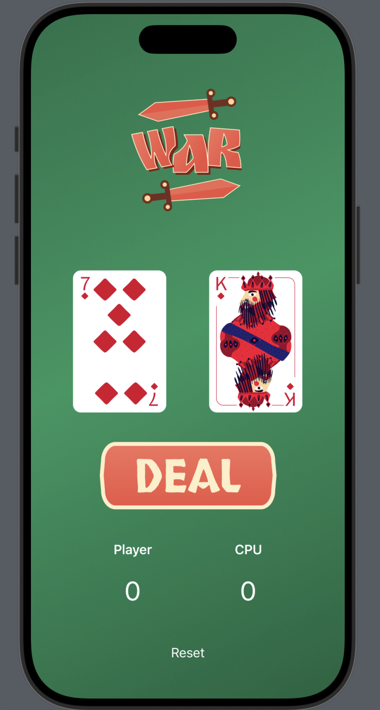

# 🏆 WAR – The Card Game  

**`A Simple & Fun iOS Card Game Built in Swift`**   



**War** is a classic card game where two players (you vs CPU) draw random cards, and the higher card wins! This game is built using **Swift and SwiftUI**, designed for a smooth and visually appealing experience.  

---

## 🎮 **Gameplay Rules**  

- Click the **"DEAL"** button to draw a card for both the **Player** and **CPU**.  
- The **higher card wins** the round, and the score is updated accordingly.  
- If the cards are **equal**, it's a WAR! (Add a tie-breaker rule if needed).  
- Press **"Reset"** to restart the game.  

---

## 🛠 **Tech Stack**  

- **Language:** Swift  
- **Framework:** SwiftUI  
- **UI Elements:** Buttons, Images, State Management  
- **Logic:** Random card generation, conditional rendering, scorekeeping  

---

## 📸 **Screenshots**  

| Game Screen | Game in Action |  
|-------------|---------------|  
|  | *(Add another gameplay screenshot here if available!)* |  

---

## 🔥 **Features**  

✅ **Smooth UI** – Built with SwiftUI for a clean and modern look  
✅ **Dynamic Card Animation** – Cards change dynamically when dealing  
✅ **Score Tracking** – Keeps count of player vs CPU wins  
✅ **Quick Restart** – Reset button to restart the game anytime  

---

## 📥 **Installation & Setup**  

1️⃣ **Clone the repository:**  
```bash
git clone https://github.com/your-username/war-card-game.git
cd war-card-game
```
2️⃣ **Open in Xcode**  
3️⃣ **Run on iOS Simulator or Device**  
4️⃣ **Press "DEAL" to start playing!**  

---

## 🛠 **Future Improvements**  

🚀 Add **sound effects** for card draws  
🚀 Introduce **animations** for a better experience  
🚀 Implement a **multiplayer mode**  
🚀 Enhance **AI strategy** for CPU  

---

## 📬 **Contact & Contributions**  

| [](https://www.linkedin.com/in/vikshitkode/) | [](https://github.com/vikshitkode) |  
|---|---|  

💡 **Feedback & contributions are welcome!** If you have ideas for improvements, feel free to submit a **pull request** or open an **issue**.  

---

🚀 **Enjoy Playing War – The Classic Card Game!** 🎴  
